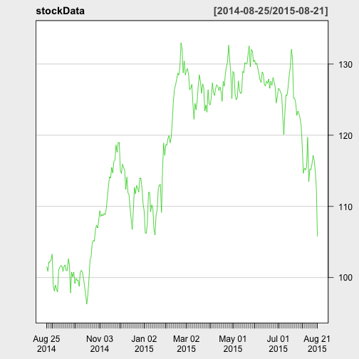

Historical Data to predict Future Prices
========================================================
author: Brian White
date: August 23 2015
transition: rotate

Proposed Problem & Solution
========================================================

Can historical prices of stock, be a good indicator of return on stocks purchased today?

[Stock Futures](https://r6brian.shinyapps.io/stockValues), by default, displays the SPY ticker (an index of the entire S & P 500). To look up a different stock, type in a stock symbol that Yahoo finance will recognize. You can find a list of Yahoo’s stock symbols [here](http://finance.yahoo.com/lookup). Some common symbols are GOOG (Google), AAPL (Apple), and GS (Goldman Sachs).

Stock Futures relies on the 
 - quantmod package, which uses the getSymbols() call to download financial data straight into R from yahoo.
 - chartSeries to display prices in an semi-attractive chart.


Methodology
========================================================


```r
library(quantmod)

stockChoice <- "AAPL"
historicalDays <-365

stockData <- getSymbols(stockChoice, src = "yahoo", 
                   from = as.Date(as.character(Sys.Date()))-as.numeric(historicalDays),
                   to = as.character(Sys.Date()),
                   auto.assign = FALSE)
names(stockData) <- c("open","high","low","closed","volume","adjusted")

stockMean <- mean(stockData$adjusted)
currentPrice <- stockData[nrow(stockData),"adjusted"]
percentageGain <- format(( stockMean - currentPrice )/currentPrice * 100, digits=2, nsmall=2 )
```

Results
========================================================


```
[1] "Using 365 days of historical data, indicates a  10.06% return on purchasing AAPL @ 105.760002."
```

 


Conclusion
========================================================

Stock prices are volitale and there is no way to accurately predict prices on the short term. Longer ranges of historical data, are a better indicator on potential returns on purchasing stocks.
